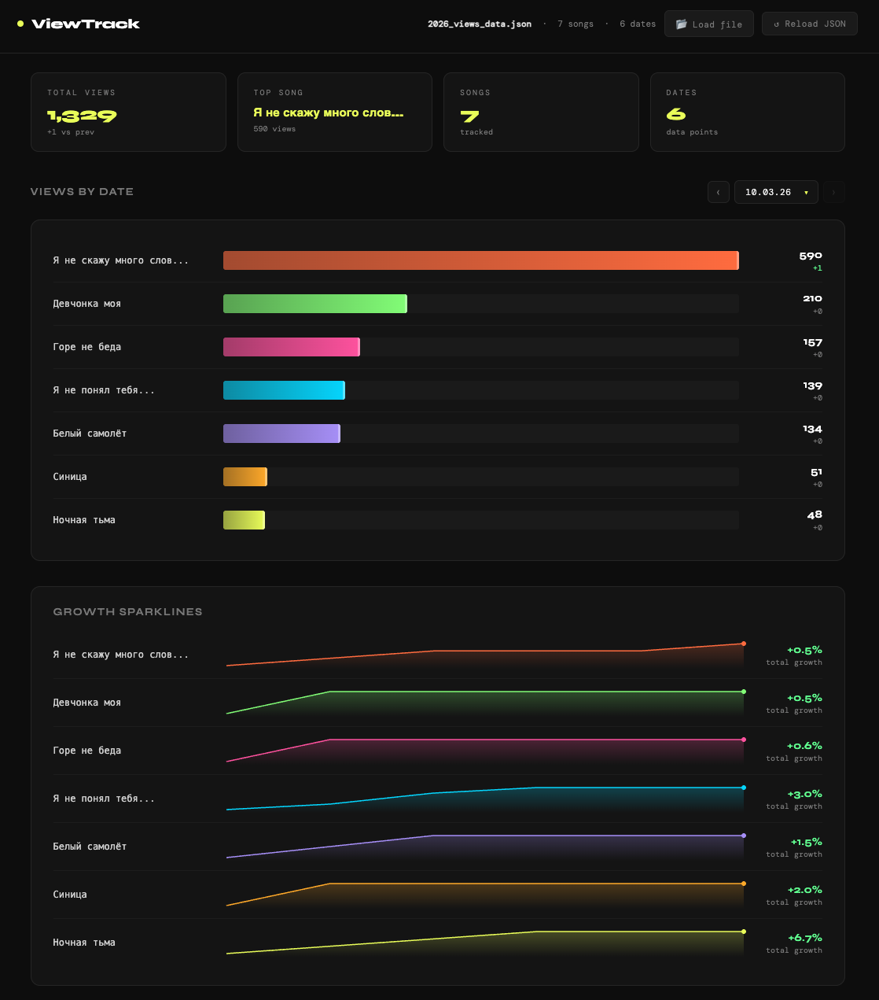

# ViewTrack

A two-part tool for tracking YouTube song view counts over time:

- **`youtube_views.py`** — scrapes view counts from a list of YouTube URLs and saves them to a JSON file. Runs locally or as an AWS Lambda on a daily schedule.
- **`dashboard.html`** — a lightweight, zero-dependency browser dashboard that visualises the data. No build step, no server required.



---

## Features

- **Auto-loads data** from `YYYY_views_data.json` on startup
- **Ranked bar chart** showing view counts per song for any selected date
- **Date dropdown** with ‹ › arrow navigation — scales to any number of dates
- **Delta indicators** showing view change vs. the previous date
- **Growth sparklines** per song across the full date range
- **Summary stats** — total views, top song, delta vs. previous date
- **Song links** — song names are clickable and open the YouTube URL
- **Manual file loading** — swap in a new `.json` via button or drag & drop anywhere on the page
- **↺ Reload** button to re-fetch the JSON after updating it

---

## File Structure

```
your-folder/
├── youtube_views.py      # Scraper — fetches view counts and writes JSON
├── urls.txt              # One YouTube URL per line
├── dashboard.html        # The dashboard (open this in a browser)
├── screenshot.png        # Dashboard screenshot (for README)
└── 2026_views_data.json  # Generated data file (year-based filename)
```

The dashboard automatically looks for `YYYY_views_data.json` matching the current year.

---

## Scraper (`youtube_views.py`)

The scraper reads URLs from a text file, fetches the current view count for each video, and updates the JSON data file. Each daily run adds a new date column to the existing data.

### Local usage

```bash
python youtube_views.py                            # urls.txt -> YYYY_views_data.json
python youtube_views.py urls.txt                   # custom URL file
python youtube_views.py urls.txt my_data.json      # custom URL file and JSON
```

`urls.txt` format — one YouTube URL per line, lines starting with `#` are ignored:

```
https://www.youtube.com/watch?v=RFjUGaRPHBw
https://www.youtube.com/watch?v=vLulRBU5Ysc
# this line is ignored
https://youtu.be/pdnlFh683xk
```

### AWS Lambda usage

Deploy `youtube_views.py` as a Lambda function (Python 3.12, handler: `youtube_views.lambda_handler`) and configure the following environment variables:

| Variable | Default | Description |
|---|---|---|
| `S3_BUCKET` | `my-youtube-views` | S3 bucket name |
| `S3_URLS_KEY` | `urls.txt` | Path to the URLs file in the bucket |
| `S3_JSON_PREFIX` | `` | Key prefix for the JSON output file |

The JSON is read from and written back to `s3://<S3_BUCKET>/<S3_JSON_PREFIX><YYYY>_views_data.json`.

Required IAM permissions for the Lambda execution role:
- `s3:GetObject`, `s3:PutObject` on `arn:aws:s3:::my-youtube-views/*`
- `s3:ListBucket` on `arn:aws:s3:::my-youtube-views`

Schedule with EventBridge: `cron(0 9 * * ? *)` runs every day at 09:00 UTC.

---

## Data Format

```json
{
  "dates": ["2026-03-05", "2026-03-06", "2026-03-07"],
  "songs": [
    {
      "id": "RFjUGaRPHBw",
      "title": "Song Title",
      "url": "https://www.youtube.com/watch?v=RFjUGaRPHBw",
      "views": {
        "2026-03-05": 45,
        "2026-03-06": 46,
        "2026-03-07": 47
      }
    }
  ]
}
```

---

## Running the Dashboard

### Served over HTTP (recommended)

Place `dashboard.html` and `YYYY_views_data.json` in the same folder and serve it with any local HTTP server. The JSON will load automatically on startup and **↺ Reload JSON** will re-fetch it without any user interaction.

```bash
# Python (no install required)
python -m http.server 8000
```

Then open `http://localhost:8000/dashboard.html` in your browser.

### Opened directly from the filesystem (`file://`)

Browsers block network requests from `file://` URLs due to CORS restrictions. In this case the dashboard shows a startup screen prompting you to select the JSON file manually. Drag and drop also works. Once loaded, **↺ Reload JSON** will re-open the file picker.

In both cases you can also:

- Click **📂 Load file** in the header to swap in a different `.json` file
- **Drag and drop** any `.json` file anywhere onto the page

---

## Browser Compatibility

Works in any modern browser (Chrome, Firefox, Safari, Edge). No internet connection required after the Google Fonts load — fonts will gracefully fall back to system monospace if offline.
